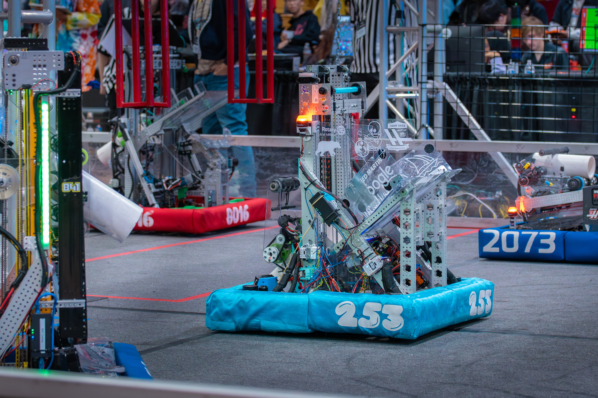

# 2025 Reefscape Code for The Boba Bot's `Mana-TEA`
This repository holds the robot code for FRC team 253's on-season and offseason robot. 

## Capabilities at a Glance:

### Reef Contributions
- Coral Scoring on `L1`, `L2`, and `L3`
- Human Player Only `Funnel Intake`
- Teleoperated Stats (from Capital City Classic):
  
|  L1  | L2 |   L3   |      Avg      |
|--------------|--------|------------|-----------------|
| 1.5   | 4.5  | 5.2 | 9.5 |

### Algae Contributions
- Dealgify `Low` and `High`
- Removed Algae remains on the ground
### Barge Contributions
- Endgame `Park`

### Auto Routines
- For Points: 2 Piece - L2 Rush targeting reef branches closest to driverstation, cycling on the sides of HP station to avoid collision with alliance partners
- For Auto RP: 1 Piece - L2 Any branch on reef backside, timed stagger optional.

### Vision
- 2x Limelight 4
- Basic MT1 measurements fused with wheel odometry for pose correction.
- PID based Pathfind-To-Pose command used for Reef Auto-Align.

## 2025 Season Performance Recap:
- TOURNAMENT WINNERS - Capital City Classic - Alliance 3
- ELIMINATED IN ROUND 3 - Calgames - Alliance 4
- Rank 34/35 - Pinnacles Regional
- Rank 25/55 - East Bay Regional

Additional Information:  
Team Website! : https://www.bobabots253.org/
